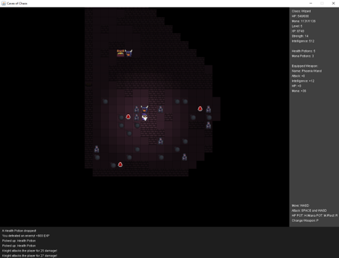
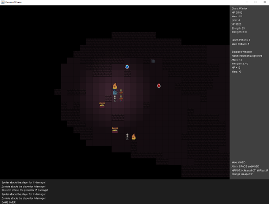

# Caves-of-Chaos

Α fun roguelike that will give you a small break from your troubles... or not? Up for the challenge?

**Caves of Chaos** is a Java roguelike dungeon crawler, where you have to descend 10 Treacherous levels and finally face the Serpent of Chaos. On your quest for the Luminous Diamond, you’ll battle hordes of enemies, gather powerful loot, and grow stronger with each step.... if you survive. Forged in Java (Swing) as part of my Master’s OOP course, with playfulness.

In this game, the player chooses their preferred class, Wizard or Warrior, waits a moment for the dungeon to awaken and begins his adventure... again. He is welcomed by a muddy cave, shrouded in darkness. As the Hero ventures through the dark corners of the caves, he faces various enemies, shaped by countless moons of hunger, these creatures thirst for human flesh.

As the players slashes through the hordes while taking occasional naps to regain strength, the player discover ladders that lead to even more chaotic levels. Along the way , he uncovers glorious loot, vital potions and sneaky traps. 

At the final level, the Hero comes face to face with the Serpent of Chaos. Only by slashing through this fearsome beast, he will claim the Legendary Diamond and hear  the trumpets of Victory.

### Dungeon Gameplay

  
  

## Features

- **Built entirely in Java**.  
- **10 Challenging Levels** – dark dungeons with fog of war.  
- **Procedurally Generated Maps** – each playthrough is unique.  
- **Dynamic Enemies** – simple AI follows and attacks the player.  
- **Randomized Loot & Items** – weapons, health/mana potions, and traps.  
- **Inventory System** – equip weapons, manage items, and use consumables strategically.  
- **Leveling System** – progress up to level 6, gaining strength, health, and mana.  
- **Rest Mechanics** – restore health and mana to prepare for upcoming challenges.  
- **Class Selection UI** – pick your hero and start your adventure.  
- **Immersive Audio & Visuals** – themed sprites, sound effects, and background music.

##  🎮 Controls

- **Arrow keys / WASD**: Move your character  
- **R**: Rest to regain health and mana  
- **H**: Use health potion  
- **M**: Use mana potion  
- **P**: Pick up or drop weapon  
- **Space + Direction**: Attack in a chosen direction  

## Future Improvements
- More playable classes  
- Additional enemy types and AI behaviors  
- New weapons, potions, and traps  

## Installation

Grab the EXE and enjoy the adventure, just don’t get too carried away!😉
Tip: Don't forget to have Java installed!

## Credits
A Big Thank You to the following sites and creators for generously sharing their work, I could never hope to match their skill and artistry!

- **Sprites:** [Deep Dive Game Studio](https://deepdivegamestudio.itch.io/)  
- **Sound Effects:** [ElevenLabs](https://elevenlabs.io/)  
- **Music & Inspiration:** [RyiSnow on YouTube](https://www.youtube.com/@RyiSnow)  

## 📬 Feel free to reach out if you have any questions or feedback!

